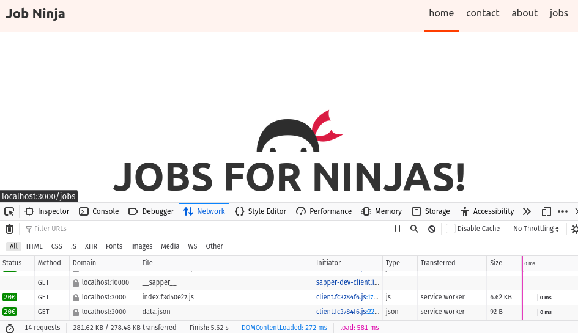

# svelte-practice

Notes about routing options:
* React Routing
  * Most similar to React Router
  * Needs a server
* React SPA Router
  * No server / SPA only
  * Bad for Search Engine Optimisation (SEO) - not as easily crawlable
  * Uses hash ID routing (website.com#this/is/your/route) - >:(
* Sapper
  * Most official router - but will never get a production version
  * Can use with server (npm run build)
  * Can use without server (npm run export)
  * Lots of features
* Routify
  * Lots of features
  * Can use without a server

Sapper and Routify are the only good options for most scenarios IMO.

## 01. Introduction

See [Sapper documentation](https://sapper.svelte.dev/docs/).

## 02. Setup

```
npx degit "sveltejs/sapper-template#rollup" job-ninja
cd job-ninja
npm install
```

Dev server: `npm run dev`

SSR:
* Build: `npm run build`
* Run: `node __sapper__/build`

SPA:
* Build: `npm run export`
* Run: `npx serve __sapper__/export `

If we have static content like images in the static folder, we can access them
easily using `src="my-static-file.png"`

## 03. Routes


**Folder vs Component routes**

In the `src/routes` folder, we can either use a folder
`about/index.svelte` or a file `about.svelte` for our routes.

We will use single file components for routes when possible, and folders
when there are multiple pages under one parent route.

Routes:
Route | File
---|---
`/` | routes<b>/</b>index.svelte
`/about` | routes<b>/about</b>.svelte
`/contact` | routes<b>/contact</b>.svelte
`/jobs` | routes<b>/jobs</b>/index.svelte
`/jobs/create` | routes<b>/jobs/create</b>.svelte

Files starting with an _underscore are not registered as routes.

**slugs**

We can also see `[slug].svelte` components. It represents a variable in the
URL resource path (productId, postId, etc).

If is no existing component (i.e. `my-post.svelte`), then it will run the
`[slug].svelte` page.

**Error and Layouts**

* `_error.svelte`
* `_layout.svelte`

## 04. Custom layout & Nav

`_layout.svelte`

A layout will put the contents of the component inside. If the parent route
also has a layout, there will be a layout inside of a layout.

We will create a `Footer.svelte` and add it to the layout.

We will update the `Nav.svelte` links. Add a contact and jobs page. Remove blog.

The `aria-current` is used to add a class name to the components in a route.
We can ignore this for now.

**The segment prop**

The `segment` variable is provided to our layout component. It is passed into
our Nav component as a prop.

Segment = tells us the page we are currently viewing.

* `undefined` = `index.svelte`
* `undefined` = `_error.svelte`
* `about` = `about.svelte`
* `jobs` = `jobs/index.svelte`
* `jobs` = `jobs/create.svelte`

We can use this to style the pages differently.

We will use segment to add a class on the nav links.

```svelte
    <li><a class:current={segment === undefined} href=".">home</a></li>
    <li><a class:current={segment === 'contact'} href="contact">contact</a></li>
    <li><a class:current={segment === 'about'} href="about">about</a></li>
    <li><a class:current={segment === 'jobs'} href="jobs">jobs</a></li>
```

## 05. Server code vs Client code

The code in the `<script>` tag can run in both the browser and the server.

The first request runs in the server and browser, then subsequent requests are
only in the browser.

If we do `console.log('my page')`, it will be printed in the server console
for the first request.

When we change the page, it is only printed to the browser console.

```svelte
<script>
	console.log('jobs')
</script>
```

`onMount` will only ever run in the browser. It is tied to the component.

`fetch` is not defined in a server, so we should only use it on mount.

## 06. Preloading Data (server or client)

A script tag with `context="module"` is not part of the component and always
runs before the other scripts.

We can perform a `fetch` on the server (as well as the browser) using a preload
function.

```svelte
<script context="module">
	export async function preload(page, session){
		const result = await this.fetch('/data.json')
		const todos = await result.json()
		console.log("jobs page pre-load data")
		return { todos }
	}
</script>

<script>
	export let todos; // Todos data from server
	console.log(todos)
	console.log('jobs page')
</script>
```

It will either fetch from the browser or server, but not both. (Unlike the
regular script tag, which runs on both).

We can also go to the `Nav.svelte` and add this preload function to the button:

```svelte
			<li><a rel=prefetch class:current={segment === 'jobs'} href="jobs">
        jobs
        </a></li>
```

`rel=prefetch` causes the prefetch function to run when you hover over the
link! This makes it even faster when you want go to a new page without waiting
for data.



Essentially this allows us to get data faster by (1) getting it from the
server, or (2) loading it when the user hovers the mouse over the button.

## 07 Server Routes